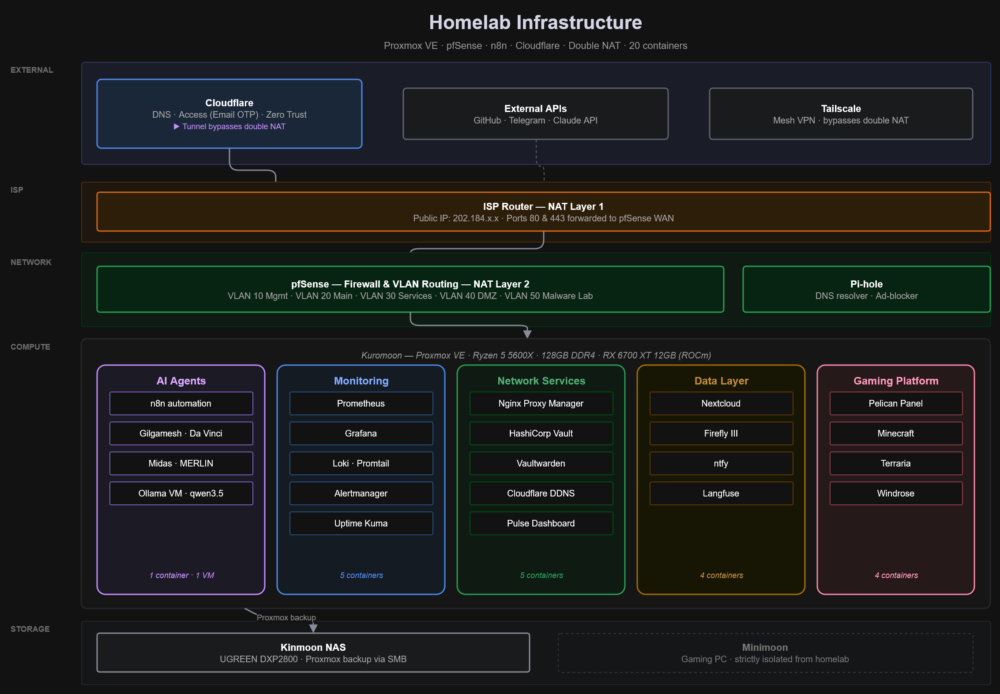
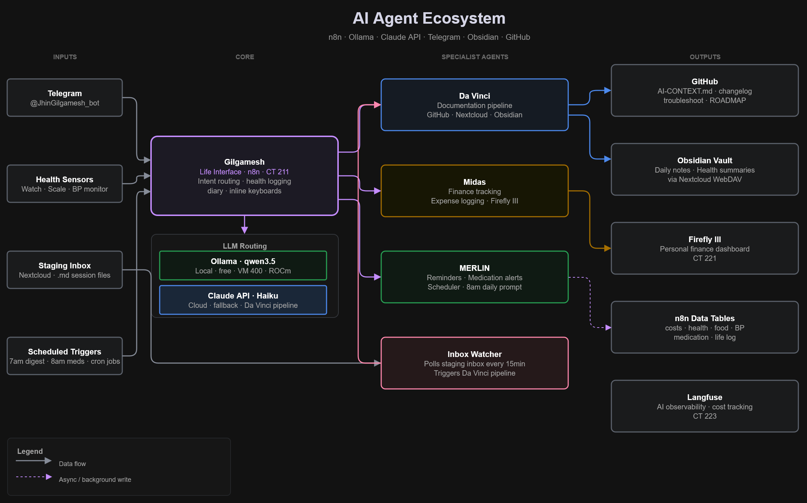

# Homelab Infrastructure

> Self-hosted AI agent ecosystem and enterprise-grade homelab built on Proxmox VE.
> Documented end-to-end as a portfolio for cloud and infrastructure engineering roles.

---

## What this is

A production-grade homelab running 20 LXC containers and 1 KVM VM on Proxmox VE, built from scratch as a hands-on portfolio project. The centrepiece is a self-hosted AI agent ecosystem — a constellation of specialised agents (Gilgamesh, Da Vinci, Midas, MERLIN) that handle daily life management, automated documentation, finance tracking, and infrastructure monitoring.

The entire system is designed to eventually run at near-zero cloud API cost using local LLM inference via Ollama.

---

## Infrastructure overview

---

## AI agent ecosystem

The system uses hybrid LLM routing — simple queries go to a local Ollama instance (qwen3.5, free), complex tasks route to Claude API (Haiku, ~$5/month). See [cost tracking](docs/cost-tracking.md) for the full breakdown.

---

## Tech stack

| Layer | Technology |
|-------|-----------|
| Hypervisor | Proxmox VE 8.x |
| Firewall | pfSense (double NAT, 5 VLANs) |
| DNS | Pi-hole + Cloudflare |
| Reverse proxy | Nginx Proxy Manager |
| Secrets | HashiCorp Vault + Vaultwarden |
| Automation | n8n (self-hosted) |
| AI inference | Ollama — qwen3.5 (local, ROCm) |
| AI API | Claude Haiku (Anthropic) |
| Monitoring | Prometheus + Grafana + Loki |
| Storage | Nextcloud + Kinmoon NAS (UGREEN DXP2800) |
| Observability | Langfuse |
| Finance | Firefly III |
| Notifications | ntfy (self-hosted) |
| Remote access | Tailscale + Cloudflare Access |
| Domain | najhin-gaming.com (Cloudflare) |

---

## Key achievements

- **AI cost reduction** — optimised documentation pipeline from ~$58/month (Sonnet) to ~$5/month (Haiku + local routing), a 90% reduction
- **Automated documentation** — Da Vinci agent automatically merges session summaries into GitHub docs via a Nextcloud staging inbox pipeline
- **Full observability** — Prometheus + Grafana + Loki + Uptime Kuma across all containers with Telegram alerting
- **Zero-trust access** — Cloudflare Access with Email OTP protecting all public-facing services
- **Self-hosted AI agents** — 4 specialist agents running 24/7 via n8n handling life management, finance, reminders, and documentation

---

## Repository structure

    homelab-infrastructure/
    ├── AI-CONTEXT.md          # Master project state (for AI context)
    ├── ROADMAP.md             # Full phase plan and future work
    ├── README.md              # This file
    └── docs/
        ├── assets/            # Diagrams and images
        ├── phases/            # Build phase history and timeline
        ├── architecture.md    # System architecture details
        ├── current-state.md   # Live infrastructure inventory
        ├── service-catalog.md # All services and endpoints
        ├── changelog.md       # Change history
        ├── troubleshoot.md    # Errors and resolutions
        ├── decisions.md       # Architecture decision records
        └── cost-tracking.md   # API cost log and optimisation history

---

## Build history

This homelab was built across 40+ phases over 5 months. See [docs/phases/](docs/phases/) for the full timeline.

---

## About

Built by [Muzakkir Kholil](https://linkedin.com/in/muzakkir-kholil) — Customer Service Engineer at F-Secure, transitioning to infrastructure and cloud engineering.

📧 muzakkir.kholil06@gmail.com
